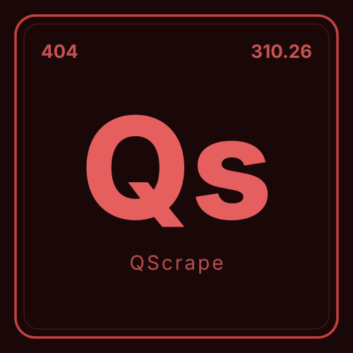

<p align="center">
  <a href="https://qscrape.dev">
    <picture>
      <source media="(prefers-color-scheme: dark)" srcset="media/logo-dark.svg">
      <source media="(prefers-color-scheme: light)" srcset="media/logo-light.svg">
      
    </picture>
  </a>
</p>

<p align="center">
  <a href="https://discord.gg/5WZNzFZtgb"></a>
  <a href="https://opensource.org/licenses/Apache-2.0"></a>
</p>

# QScrape

Web scraper evaluation suite. Fictional test sites across three difficulty levels for benchmarking scraper capabilities.

> [!WARNING]
> QScrape is research tooling for API design and web reverse engineering. **You assume all legal risk for how you use it.** Respect `robots.txt`, rate limits, and IP bans; and please don't bypass them with Tor or a VPN. Read [DISCLAIMER.md](DISCLAIMER.md) before pointing it at anything.

Made by [Cascading Labs](https://cascadinglabs.com), used for [Yosoi](https://github.com/CascadingLabs/Yosoi).

## Sites

| Level | Route | Site | Status |
|-------|-------|------|--------|
| L1 | `/l1/news/` | Mountainhome Herald — news portal | live |
| L1 | `/l1/scoretap/` | ScoreTap — esports scores | live |
| L1 | `/l1/taxes/` | Eldoria Registry of Deeds — tax records | live |
| L1 | `/l1/eshop/` | VaultMart — e-commerce catalogue | live |
| L2 | `/l2/react/news/` | Mountainhome Herald — React | live |
| L2 | `/l2/react/eshop/` | VaultMart — React | live |
| L2 | `/l2/react/scoretap/` | ScoreTap — React | live |
| L2 | `/l2/react/taxes/` | Eldoria Registry of Deeds — React | live |
| L2 | `/l2/vue/news/` | Mountainhome Herald — Vue | live |
| L2 | `/l2/vue/eshop/` | VaultMart — Vue | live |
| L2 | `/l2/vue/scoretap/` | ScoreTap — Vue | live |
| L2 | `/l2/vue/taxes/` | Eldoria Registry of Deeds — Vue | live |
| L2 | `/l2/svelte/news/` | Mountainhome Herald — Svelte | live |
| L2 | `/l2/svelte/eshop/` | VaultMart — Svelte | live |
| L2 | `/l2/svelte/scoretap/` | ScoreTap — Svelte | live |
| L2 | `/l2/svelte/taxes/` | Eldoria Registry of Deeds — Svelte | live |
| L3 | `/l3/` | Anti-bot sites | planned |

## Dev

```bash
pnpm install
pnpm dev       # http://localhost:4321
pnpm build
pnpm preview
```

## Lint

```bash
pnpm check     # biome check + autofix
pnpm lint      # biome lint only
pnpm format    # biome format
```

## Community

- **Responsible use:** see [DISCLAIMER.md](DISCLAIMER.md)

## Contact

[contact@cascadinglabs.com](mailto:contact@cascadinglabs.com)
